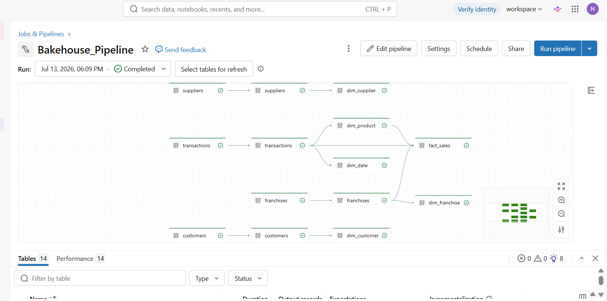

# Bakehouse Sales Analytics: End-to-End Data Engineering & BI Platform

## 📌 Project Overview
Bakehouse Sales Analytics is an enterprise-grade, end-to-end data engineering and analytics solution built entirely on the **Databricks Lakehouse** platform using the **Medallion Architecture (Bronze → Silver → Gold)**. 

The platform automates the extraction, cleaning, and dimensional modeling of distributed transactional data across multiple bakery franchise locations. The final optimized data warehouse powers an executive-facing interactive business intelligence dashboard, transforming raw operational events into strategic, real-time business insights.

---

## 🛠️ Tech Stack & Architecture
* **Platform & Infrastructure:** Databricks Lakehouse (Serverless Compute, Photon Accelerated Engine)
* **Storage & Data Management:** Delta Lake, Unity Catalog
* **Pipeline Framework:** Spark Declarative Pipelines (Delta Live Tables style SQL)
* **Data Modeling:** Dimensional Star Schema Design (Kimball Methodology)
* **BI & Visualization:** Databricks Interactive Dashboards

---

## 🏗️ Data Architecture (The Medallion Flow)

The platform isolates processing stages into distinct physical database schemas to maintain data lineage, reproducibility, and high performance.

### 1. Ingestion Layer (`_bronze_bakehouse`)
An append-only raw data landing zone that preserves the original source structure without transformations. It ingests distributed data from `samples.bakehouse` into four core materialized views:
* `transactions`: Raw point-of-sale transactional event records.
* `customers`: Raw customer master profiles.
* `franchises`: Raw retail location configuration records.
* `suppliers`: Raw vendor lookup records.

### 2. Conformance & Enrichment Layer (`_silver_bakehouse`)
Cleanses raw operational streams, enforces data quality standards, and creates analytical fields while preserving historical transaction grain:
* **Data Sanitization:** Standardization of customer, franchise, and supplier profiles.
* **Temporal Enrichments:** Upgrades the transactional timestamps by extracting advanced analytical time-slices: `sale_date`, `sale_year`, `sale_month`, `sale_quarter`, and `day_of_week` to accelerate time-series reporting.

### 3. Business Analytics Layer (`_gold_bakehouse`)
Transforms flat, cleansed tables into an optimized **Star Schema Dimensional Model** specifically designed to eliminate redundant joins and maximize BI dashboard query speeds.

#### 📊 Fact Table
* `fact_sales`: The central transactional table containing 13 distinct columns. It joins business metrics via foreign keys (`customer_key`, `franchise_key`, `product_key`, `date_key`, `supplier_key`) alongside explicit granular operational measures (`quantity`, `unitPrice`, `totalPrice`) and degenerate dimensions (`transactionID`, `paymentMethod`).

#### 🗂️ Dimension Tables
* `dim_customer`: Comprehensive customer profile mapping 14 attributes including geographic hierarchies (`city`, `state`, `country`, `continent`) and demographics.
* `dim_franchise`: Location attributes containing 11 metrics including geocoordinates (`latitude`/`longitude`), facility size classification, district groupings, and associated supplier configurations.
* `dim_product`: Clean master data table mapping descriptive product catalog names to unified product keys.
* `dim_date`: Dedicated date table supporting temporal rollups (Year → Quarter → Date).
* `dim_supplier`: Consolidated operational supplier profiles.

---

## ⚙️ Pipeline Orchestration (`Bakehouse_Pipeline`)
The entire automated ETL/ELT data lifecycle is managed by a production-ready **Spark Declarative Pipeline**:
* **Runtime Optimization:** Configured with serverless Photon acceleration to scale computational efficiency during intensive transformations.
* **Modularity:** Isolation of business logic scripts hosted in the project's `/transformations` directory.
* **Data Lineage:** Automatically maps and executes the system dependency graph (DAG) sequentially from source tables directly to the downstream dimensional golden tables.



---

## 📈 Executive Sales Analytics Dashboard
The final modeled business layer plugs directly into an automated workspace reporting suite, compiling the data into 5 high-performance gold datasets (`sales_metrics`, `top_products`, `top_franchises`, `payment_method_breakdown`, `quarterly_performance`).

> [!NOTE]
> 📊 **[Open & Download the Full Executive PDF Report](./documents/Bakehouse_Sales_Analytics_Dashboard.pdf)** > *Click the link above to open and read the high-resolution vector PDF layout natively using GitHub's built-in scrollable document reader.*

### Executive Performance Metrics Covered:
* **Financial Health:** Total Revenue (\$66.47K), Average Order Value (AOV: \$19.94)
* **Volume Analysis:** Total Transaction Volumes (3.33K counts), Total Items Sold (22.16K items)

### Delivered Visualizations:
1. **Revenue Trend Over Time:** Time-series analysis tracking daily revenue performance patterns.
2. **Top 10 Products by Revenue:** Bar chart pinpointing highest-grossing inventory lines (e.g., Pearly Pies, Tokyo Tidbits, Outback Oatmeal).
3. **Top 10 Franchises by Revenue:** Location-based chart highlighting leading retail properties along with city/country geographic groupings.
4. **Revenue by Payment Method:** Distribution pie chart evaluating customer transaction network types (Visa, Mastercard, Amex).
5. **Quarterly Performance Analytics:** High-level metrics monitoring financial growth trajectory over operational quarters.

---

## 📂 Repository File Tree
```text
├── transformations/
│   ├── 01_bronze_layer.sql
│   ├── 02_silver_layer.sql
│   └── 03_gold_layer.sql
├── documents/
│   └── Bakehouse_Sales_Analytics_Dashboard.pdf
├── images/
│   ├── pipeline_dag.png
│   └── workspace_structure.png
└── README.md
