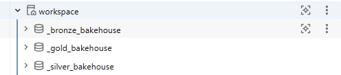

# Bakehouse Sales Analytics: End-to-End Data Engineering & BI Platform

## 📌 Project Overview
This repository hosts a production-grade data engineering pipeline and business intelligence platform built entirely within the **Databricks Lakehouse Environment**. The project processes raw, distributed operational transaction data from a retail bakery franchise business ("Bakehouse") and applies the **Medallion Architecture** to clean, model, and serve enterprise-ready insights. 

The pipeline transitions data from raw ingestion to a structured **Star Schema (Fact & Dimension tables)**, which directly powers an executive-facing interactive analytics dashboard.

---

## 🏗️ Data Architecture & Pipeline Topology
The data workflow is split into isolated transactional environments using Databricks schemas (`_bronze_bakehouse`, `_silver_bakehouse`, and `_gold_bakehouse`):

### 1. Ingestion Layer (Bronze)
* **Target Schema:** `_bronze_bakehouse` 
* **Tables Ingested:** `customers`, `franchises`, `suppliers`, `transactions` 
* **Objective:** Store raw source data exactly as it arrives from operational sources.

### 2. Cleaning & Conformance Layer (Silver)
* **Target Schema:** `_silver_bakehouse` 
* **Tables Processed:** `customers`, `franchises`, `suppliers`, `transactions` 
* **Objective:** Perform schema enforcement, deduplicate tables, handle null fields, and uniform operational data into cleanly structured tables.

### 3. Business & Modeling Layer (Gold)
* **Target Schema:** `_gold_bakehouse` 
* **Objective:** Build an optimized dimensional model (**Star Schema**) optimized for high-performance analytical queries and BI reports.
* **Data Model Implementation:**
  * **Fact Table:** `fact_sales` containing core analytical measures (`total_revenue`, `transaction_count`, `total_quantity`, `avg_order_value`) and degenerate dimensions (`transactionID`, `paymentMethod`, `cardNumber`)
  * **Dimension Tables:** `dim_customer`, `dim_date`, `dim_franchise`, `dim_product`, and `dim_supplier`.

---

## 🛠️ Tech Stack & Technical Competencies
* **Platform:** Databricks Lakehouse (Serverless 2XS SQL Warehouse Compute) 
* **Storage Layer:** Delta Lake (Unity Catalog compliant)
* **Language:** Spark SQL (Modular multi-file scripts) 
* **Workflow Automation:** Databricks Jobs & Pipelines (DAG Dependency Mapping) 
* **Data Modeling:** Dimensional Star Schema Design (Kimball Methodology)
* **BI Layer:** Databricks Dashboards (Executive Overview Edition) 

---

## 📊 Pipeline Lineage & DAG Visualization
The automated `Bakehouse_Pipeline` orchestrates asset dependencies sequentially, splitting extraction, entity transformation, and business mapping:

This modular approach divides workload steps into discrete script files to optimize query efficiency and debugging:
* [01_bronze_layer.sql](./sql-scripts/01_bronze_layer.sql) 
* [02_silver_layer.sql](./sql-scripts/02_silver_layer.sql) 
* [03_gold_layer.sql](./sql-scripts/03_gold_layer.sql) 

---

## 📈 Executive Dashboard & Insights
The final **Gold** layer data assets plug directly into the *Bakehouse Sales Analytics* workspace dashboard to monitor high-level operational health:

### 📂 File Formats & Viewing Options:
* **Instant Inline View:** See the embedded image above.
* **Original File:** [Download the high-resolution PDF Executive Report](./documents/Bakehouse_Sales_Analytics.pdf).

### Core Performance KPIs:
* **Total Revenue:** $66.47K 
* **Total Transactions:** 3.33K 
* **Average Order Value (AOV):** $19.94 
* **Total Volume Sold:** 22.16K items 

### Strategic Visualizations Included:
1. **Revenue Trend Over Time:** Line chart tracking daily business performance fluctuations.
2. **Top 10 Products by Revenue:** Bar chart identifying top product lines (including Pearly Pies, Tokyo Tidbits, and Outback Oatmeal).
3. **Top 10 Franchises by Revenue:** Bar chart highlighting leading business partners (such as Golden Crumbs and Sweet Sinsations).
4. **Revenue Share by Payment Method:** Percentage breakdown comparing card networks (Visa, Mastercard, Amex).
5. **Quarterly Performance Analytics:** Operational performance metrics grouped across business quarters.
